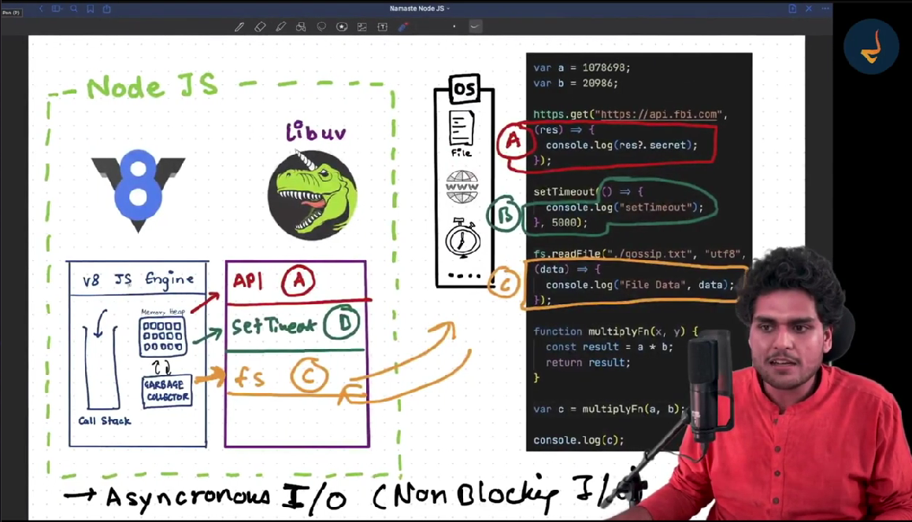

# 🚀 Episode 7: Deep Dive into Sync, Async & Event Loop

> "Time, tide, and JavaScript waits for none!" - Understanding JavaScript's execution model

<div align="center">

</div>

## 📑 Table of Contents
1. [Synchronous Code](#-synchronous-code)
2. [Asynchronous Operations](#-asynchronous-operations)
3. [setTimeout(0)](#-settimeout0-behavior)
4. [Blocking Operations](#-blocking-operations)
5. [Practical Examples](#-practical-examples)

## 💫 Synchronous Code

Let's look at a basic synchronous operation:

```javascript
var a = 1078698;
var b = 20986;

function multiplyFn(x, y) {
    const result = a * b;
    return result;
}

var c = multiplyFn(a, b);
console.log("Multiplication result is : ", c);
```

### 🔄 Behind the Scenes
1. Creates global execution context
2. Executes code line by line
3. Function execution:
   - Gets pushed to call stack
   - Executes
   - Returns result
4. V8 engine handles garbage collection

## 🚀 Asynchronous Operations

Here's how async operations work:

```javascript
console.log("Hello World");

// Async file read
fs.readFile("./file.txt", "utf8", (err, data) => {
    console.log("File Data : ", data);
});

// HTTP request
https.get("https://dummyjson.com/products/1", (res) => {
    console.log("Fetched Data Successfully");
});

console.log("Multiplication result is : ", c);
```

### 🔄 How It Works
- V8 engine offloads async tasks to libuv
- Main thread continues execution
- Callbacks are executed when ready

## ⏰ setTimeout(0) Behavior

```javascript
console.log("Hello World");

setTimeout(() => {
    console.log("call me right now ");
}, 0);  // Still waits for empty call stack!

setTimeout(() => {
    console.log("call me after 3 seconds");
}, 3000);

console.log("Multiplication result is : ", c);
```

### 🎯 Key Point
Even with 0ms delay, setTimeout callback waits for:
1. Empty call stack
2. Event loop to pick it up
3. Execution of callback

## 🛑 Blocking Operations

Example of blocking vs non-blocking operations:

```javascript
// DON'T USE - Blocks main thread
crypto.pbkdf2Sync("password", "salt", 50000000, 50, "sha512");

// BETTER - Async version
crypto.pbkdf2("password", "salt", 5000000, 50, "sha512", (err, key) => {
    console.log("Key generated");
});
```

## 💡 Practical Examples

### 1. Synchronous File Read
```javascript
// Blocks the thread
fs.readFileSync("./file.txt", "utf8");
console.log("This will execute only after file read");
```

### 2. Asynchronous File Read
```javascript
fs.readFile("./file.txt", "utf8", (err, data) => {
    console.log("File Data : ", data);
});
console.log("This executes immediately!");
```

## 🎯 Key Takeaways

1. ⚡ Synchronous code blocks the main thread
2. 🔄 Async operations are handled by libuv
3. ⏰ setTimeout(0) still follows event loop rules
4. 🚫 Avoid blocking operations
5. ✅ Use async alternatives when available

## 🚀 Best Practices

1. Use async operations for:
   - File operations
   - Network requests
   - Database queries
   - Heavy computations

2. Avoid sync methods:
   - `readFileSync`
   - `crypto.pbkdf2Sync`
   - Any method ending with 'Sync'

## 📚 Related Concepts

- Event Loop
- Call Stack
- Callback Queue
- libuv
- V8 Engine

## 🔗 Useful Resources

- [Node.js Documentation](https://nodejs.org/en/docs/)
- [libuv Documentation](https://libuv.org/)
- [JavaScript Event Loop Visualization](https://nodejs.dev/learn/the-nodejs-event-loop)

---

*Remember: Always prefer asynchronous operations to keep your Node.js application responsive and scalable! 🚀*