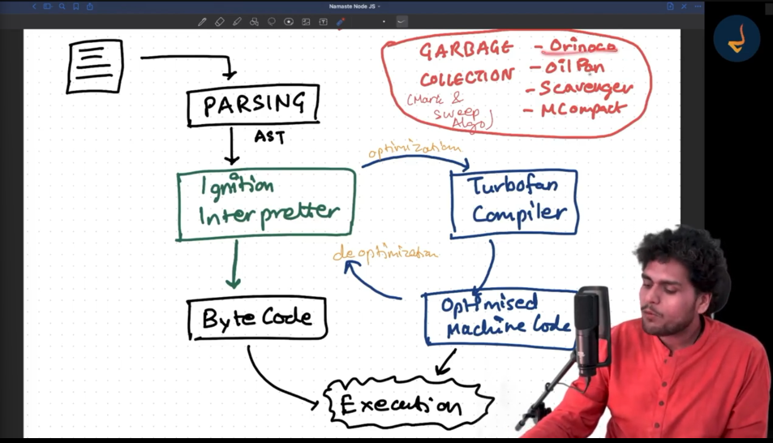
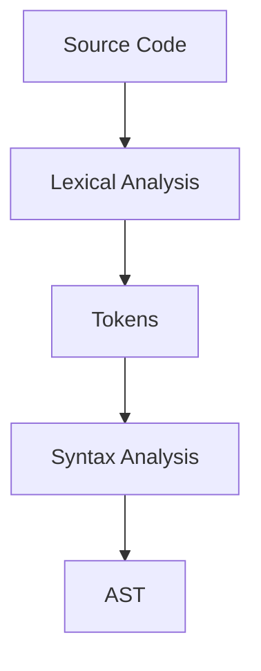
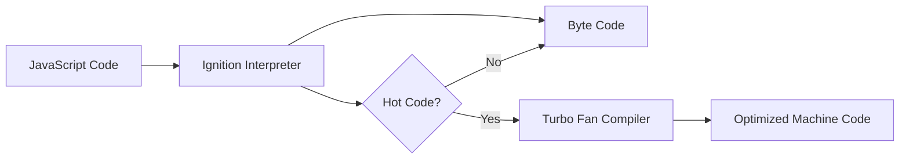
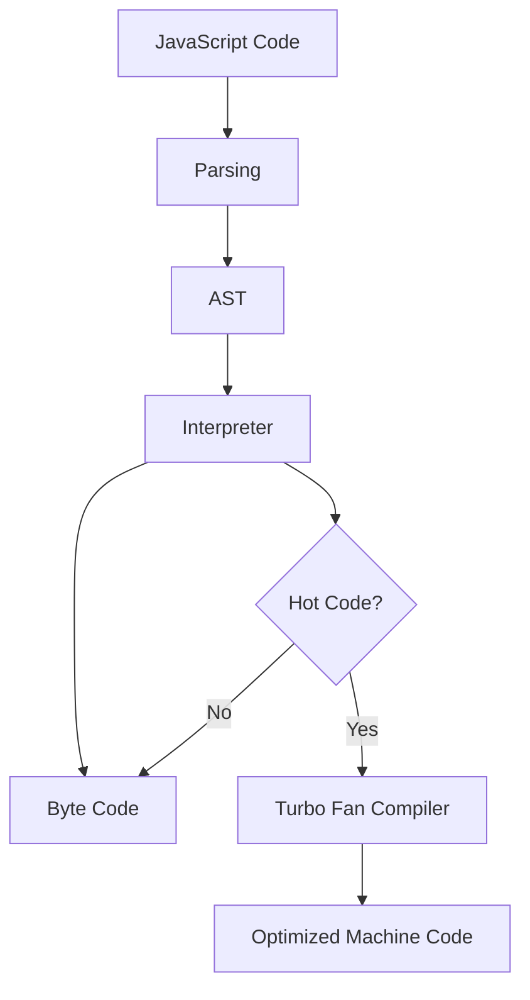
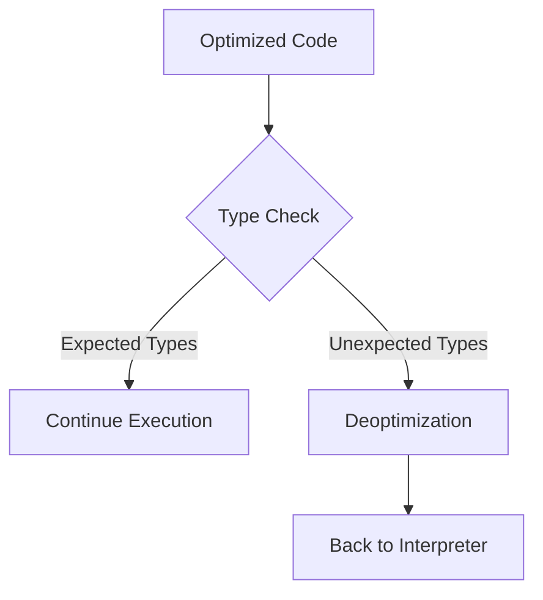

# 🚀 Episode 8: Deep Dive into V8 JavaScript Engine

> "Understanding how V8 transforms your JavaScript code into machine code"

<div align="center">

</div>

## 📑 Table of Contents
1. [Parsing Process](#-parsing-process)
2. [Interpretation & Compilation](#-interpretation--compilation)
3. [Execution Flow](#-execution-flow)
4. [Optimization & Deoptimization](#-optimization--deoptimization)
5. [Garbage Collection](#-garbage-collection)

## 🔍 Parsing Process

### Step 1: Lexical Analysis
- Code is broken down into tokens
- Token-by-token reading and analysis
- Example:
  ```javascript
  let x = 5 + 3;
  // Tokens: [let] [x] [=] [5] [+] [3] [;]
  ```

### Step 2: Syntax Analysis
- Tokens are converted into Abstract Syntax Tree (AST)
- Invalid syntax leads to token errors



## 🔄 Interpretation & Compilation

V8 uses a hybrid approach combining:
1. **Interpreter (Ignition)**
   - Executes code line by line
   - Fast initial execution
   - Produces byte code

2. **JIT Compiler**
   - Just-In-Time compilation
   - Optimizes frequently executed code



## ⚡ Execution Flow

The complete execution process:



## 🔧 Optimization & Deoptimization

### Optimization Example
```javascript
function sum(a, b) {
    return a + b;
}

// Hot code path - gets optimized
sum(1, 2);  // Numbers as expected
sum(3, 4);  // Numbers as expected
sum(5, 6);  // Numbers as expected

// Deoptimization trigger
sum("hello", "world");  // Unexpected string input!
```

### Deoptimization Process
1. TurboFan makes type assumptions
2. If assumptions break (e.g., unexpected types)
3. Code gets deoptimized
4. Falls back to interpreter



## 🗑️ Garbage Collection

V8 implements several garbage collection mechanisms:

### Components
1. **Orinoco**: Main garbage collector
2. **Oil Pan**: Memory management
3. **Scavenger**: Young generation GC
4. **Full Mark Compact**: Old generation GC

### Mark and Sweep Algorithm


## 🎯 Key Takeaways

1. ⚡ V8 uses a multi-step process to execute JavaScript
2. 🔄 Combines interpretation and compilation (JIT)
3. 🚀 Optimizes hot code paths automatically
4. 🔧 Can deoptimize code when assumptions break
5. 🗑️ Implements sophisticated garbage collection

## 📚 Further Reading

- [V8 Official Documentation](https://v8.dev/)
- [V8 Blog](https://v8.dev/blog)
- [Chrome V8 GitHub Repository](https://github.com/v8/v8)

## 🔧 Tools for V8 Analysis

- Chrome DevTools
- V8 Profiler
- Node.js --trace-opt flag

---

*Understanding V8's internals helps write more optimized JavaScript code! 🚀*